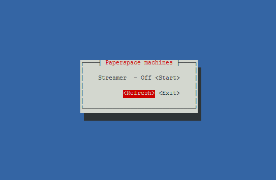

# Paperpi

Paperpi is a simple [Paperspace](https://paperspace.io/&R=GWR0NP) API client app, that allows you to start and stop virtual servers via simple ncurses-based interface. The purpose of this application is to control your Paperspace instances from something like [RetroPie](https://retropie.org.uk/) - preferably without the need to stop using your controller.



## Usage

```txt
paperpi 0.9.0
Miroslav Prasil
Tool that can be used to start and stop your Paperspace machine

USAGE:
    paperpi <token>

FLAGS:
    -h, --help       Prints help information
    -V, --version    Prints version information

ARGS:
    <token>    Paperspace API token
```

## Setup

I'm not going to guide you through setting up the Paperspace machine or configuring the streaming, etc.. There's plenty of tutorials out there and they differ depending on what technology you want to use. For intents of this Readme I assume, you have your instance ready and working and all you need now is some convenient way to turn the instance On and Off.

Following are the steps to install and configure paperpi to be used with RetroPie.

### 1. Get API token

Once you have your account created, you can [create your token](https://www.paperspace.com/console/account/api). Just give it a name and description and click "Create API token". You'll get new token - something like `be427e05d552a6d1f45e09c6901728`. Copy this value and save it somewhere as this is last time you're able to see it. If you lost it, no worries, just generate new token.

### 2. Install paperpi

You can use following install script to do most of the work for you. You need to ge to the RetroPie terminal either via ssh or from Emulationstation interface. Then change directory to the `roms` folder where you'd like to have the paperpi script present. In my case it's the `moonlight` folder:

```bash
# Create folder if it doesn't exist already, but presumably you've already tested your 
# paperspace setup, right?
mkdir -p ~/RetroPie/roms/moonlight

# Then change to that directory
cd ~/RetroPie/roms/moonlight
```

Now [prepare the API token](#1-get-api-token) if you haven't done so already and run the install script:

```bash
curl -sL https://raw.githubusercontent.com/mprasil/paperpi/master/install.sh | sudo bash
```

This will download latest paperpi binary, it will ask for your Paperspace API token and finally it will create `Paperspace.sh` script to show in the Emulationstation menu.

Don't forget to restart Emulationstation to show the new menu item, afterwards you should be ready to go.

## Support me

If you like the application and want to give something back. You can just use my referral code in Paperspace:

```txt
GWR0NP
```

You can also follow [this link](https://paperspace.io/&R=GWR0NP) and register new account if you don't have one. 

This will cost you nothing, you'll actually get $10 worth of credit free to start with and I'll get some free credit in return. Win win. This is by no means required or mandatory, I did the app for myself and don't really expect any financial benefit.